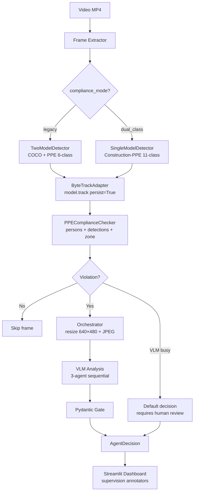

# 🦅 Munin — Industrial Vision Agent

> On-premise PPE detection for mining operations. Powered by AMD MI300X. DS 132 compliant.

[]()
[]()
[]()
[]()
[]()
[]()

---

## Overview

Munin is an industrial vision agent that detects PPE (Personal Protective Equipment) violations in mining operations in real-time. It runs entirely on-premise on AMD MI300X (192GB HBM3) — video never leaves the site.

**v3** introduces dual-mode detection (LEGACY + DUAL_CLASS), ByteTrack native tracking via `model.track(persist=True)`, supervision-powered dashboard annotators, and prompt caching for 83% token reduction on Fireworks AI.

---

## v3 Architecture



---

## Compliance Modes

| Mode | Detector | Model | Classes | Use case |
|------|----------|-------|---------|----------|
| **LEGACY** (default) | TwoModelDetector | COCO + PPE 6-class | 8 positive | Two separate YOLO models |
| **DUAL_CLASS** | SingleModelDetector | Construction-PPE fine-tuned | 11 (6 positive + 5 negative + person) | Single model with negative classes |

DUAL_CLASS mode uses `NEGATIVE_CLASS_MAP` to detect explicit absence (e.g., `no_helmet` → `hardhat` missing), providing higher precision than legacy absence-of-detection logic. See `gate/schemas.py` for the full class map.

---

## Tech Stack

| Layer | Technology |
|-------|-----------|
| GPU | AMD MI300X (192GB HBM3), ROCm 7.2.4 |
| Detection | YOLOv8n (ultralytics) with ByteTrack `model.track()` |
| VLM | Kimi K2.6 via Fireworks AI (interim) / vLLM ROCm (target) |
| Agent Framework | PydanticAI with FireworksProvider |
| Tracking | ByteTrackAdapter (primary) / PersonTracker (fallback) |
| Dashboard | Streamlit + supervision annotators (BoxAnnotator, LabelAnnotator, TraceAnnotator) |
| Backend | FastAPI |
| Validation | Pydantic v2 (structured output + Pydantic Gate) |
| Container | Docker (rocm/vllm-dev) |

---

## Quickstart

### Deploy to AMD MI300X Droplet

```bash
# From local machine — writes code, pushes to GitHub, deploys via SSH
./deploy_munin.sh --legacy       # LEGACY mode (TwoModelDetector)
./deploy_munin.sh --dual_class   # DUAL_CLASS mode (SingleModelDetector)

# Script handles: git push → SSH → docker exec → pip install → verify best.pt → run tests
```

### Docker (AMD GPU)

```bash
cp .env.example .env  # Fill in FIREWORKS_API_KEY
docker build -t munin .
docker run -it --device /dev/kfd --device /dev/dri \
  --group-add video --shm-size 8G \
  -p 8000:8000 -p 8501:8501 munin
```

### Local (CPU fallback)

```bash
pip install -r requirements.txt
# Optional: supervision for dashboard annotators
pip install supervision>=0.25.0
cp .env.example .env  # Fill in FIREWORKS_API_KEY
```

---

## Usage

```bash
# Start API
python main.py  # → http://localhost:8000

# Start dashboard
streamlit run ui/dashboard.py  # → http://localhost:8501

# Run tests
python -m pytest tests/ -v

# Deploy to droplet
./deploy_munin.sh --legacy       # LEGACY mode (TwoModelDetector)
./deploy_munin.sh --dual_class   # DUAL_CLASS mode (SingleModelDetector)
```

### Configuration

All settings via environment variables with `MUNIN_` prefix (see `.env.example`):

| Key | Default | Description |
|-----|---------|-------------|
| `MUNIN_COMPLIANCE_MODE` | `legacy` | `legacy` or `dual_class` |
| `MUNIN_YOLO_DEVICE` | `cuda:0` | GPU device |
| `MUNIN_VLM_BUSY_TIMEOUT` | `300.0` | VLM timeout in seconds |
| `MUNIN_FRAME_RESIZE_WIDTH` | `640` | Frame resize for VLM |
| `MUNIN_FRAME_RESIZE_HEIGHT` | `480` | Frame resize for VLM |
| `MUNIN_YOLO_IMGSZ` | `640` | YOLO input size (320–1280) |
| `MUNIN_PROMPT_CACHE_SESSION_ID` | `munin-session` | Fireworks prompt caching session |

### API Endpoints

| Endpoint | Method | Description |
|----------|--------|-------------|
| `/api/v1/health` | GET | Health check |
| `/api/v1/analyze` | POST | Upload MP4, start analysis |
| `/api/v1/analyze/{job_id}` | GET | Get analysis results |

---

## Project Structure

```
munin/
├── main.py                    # FastAPI entry point
├── config.py                  # AppSettings (22 fields, Pydantic BaseSettings)
├── exceptions.py              # Custom exception hierarchy
├── deploy_munin.sh            # Deploy script (SSH + docker exec)
├── pipeline/
│   ├── interfaces.py          # IDetector, ITracker, IComplianceChecker (Protocol v3)
│   ├── byte_track_adapter.py  # ByteTrack via model.track() (ADR-017)
│   ├── single_model_detector.py  # Construction-PPE 11-class (ADR-018)
│   ├── two_model_detector.py  # COCO + PPE dual-model (LEGACY)
│   ├── yolo_detector.py       # Alias → TwoModelDetector (compat)
│   ├── person_tracker.py      # IoU tracker (fallback, ITracker v3 compat)
│   ├── ppe_checker.py         # PPEComplianceChecker + ComplianceMode (ADR-013/014)
│   ├── frame_extractor.py     # OpenCV frame extraction
│   ├── pipeline.py            # E2E orchestration + stream mode
│   └── factory.py             # PipelineFactory (composition root, DI)
├── agents/
│   ├── base.py                # AgentContext (DataClass pattern)
│   ├── orchestrator.py        # 3-agent sequential + resize 640×480 (ADR-016)
│   ├── extractor.py           # Visual extraction agent
│   ├── context_analyzer.py    # Contextual risk analysis agent
│   ├── scorer.py              # DS 132 scoring agent
│   └── single_pass.py         # Fallback single-pass agent
├── vlm/
│   └── factory.py             # VLMModelFactory + SHARED_BASE_SYSTEM_PROMPT (ADR-015)
├── gate/
│   ├── schemas.py             # DetectionResult (14 classes), NEGATIVE_CLASS_MAP
│   └── validator.py           # Pydantic Gate validation
├── knowledge/
│   ├── ds132_kb.py            # DS 132 knowledge base
│   └── zone_config.py         # Zone configuration
├── api/
│   └── routes.py              # FastAPI routes
├── ui/
│   └── dashboard.py           # Streamlit + supervision annotators (ADR-019)
└── tests/
    ├── test_smoke.py             # 29 tests (imports, schemas, config, factory)
    ├── test_orchestrator.py      # 13 tests (orchestrator, agent context)
    ├── test_ppe_checker.py       # 10 tests (legacy + dual_class compliance)
    ├── test_schemas_extended.py  # 9 tests (negative classes TDD)
    ├── test_byte_track_adapter.py # 8 tests (ByteTrack TDD with mocks)
    ├── test_gate.py              # 8 tests (Pydantic Gate)
    ├── test_interfaces_v3.py     # 7 tests (Protocol compliance TDD)
    └── conftest.py               # Shared fixtures
```

---

## Testing

```bash
# Full suite (84 tests, ~3.5s)
python -m pytest tests/ -v --tb=short

# TDD components only
python -m pytest tests/test_byte_track_adapter.py tests/test_schemas_extended.py \
    tests/test_interfaces_v3.py tests/test_ppe_checker.py -v

# With coverage
python -m pytest tests/ -v --cov=munin --cov-report=term-missing
```

| Test file | Tests | TDD | Coverage |
|-----------|-------|-----|----------|
| `test_smoke.py` | 29 | No | Imports, schemas, config, factory |
| `test_orchestrator.py` | 13 | No | Orchestrator, agent context |
| `test_ppe_checker.py` | 10 | Yes | LEGACY + DUAL_CLASS compliance |
| `test_schemas_extended.py` | 9 | Yes | Negative classes in DetectionResult |
| `test_byte_track_adapter.py` | 8 | Yes | ByteTrackAdapter with MagicMock |
| `test_gate.py` | 8 | No | Pydantic Gate validation |
| `test_interfaces_v3.py` | 7 | Yes | Protocol compliance (duck typing) |
| **Total** | **84** | **4 TDD** | **All core components** |

---

## Architecture Decision Records (ADRs)

| ADR | Title | Status |
|-----|-------|--------|
| 013 | EPP assignment in PPEComplianceChecker | ✅ Vigente |
| 014 | ComplianceMode enum (LEGACY \| DUAL_CLASS) | ✅ Vigente |
| 015 | SHARED_BASE_SYSTEM_PROMPT for prompt caching | ✅ Vigente |
| 016 | Frame resize 640×480 before VLM | ✅ Vigente |
| 017 | ByteTrackAdapter via model.track() native | ✅ Vigente (modifies ADR-012) |
| 018 | IDetector abstraction (TwoModel + SingleModel) | ✅ Vigente |
| 019 | Supervision in dashboard only (not pipeline) | ✅ Vigente |
| 020 | Deploy via docker exec in existing container | ✅ Vigente |

---

## DS 132 Compliance

Munin checks PPE compliance against Chilean DS 132 (Decreto Supremo 132):

- **Art. 38:** Mandatory PPE (helmet, vest, boots)
- **Art. 42:** Harness for work at height
- **Art. 45:** Eye protection in processing zones
- **Art. 50:** Maintenance zone requirements

---

## Tech Debt

| Item | Severity | Description | Next step |
|------|----------|-------------|-----------|
| Stream mode + ByteTrack | Low | `_process_stream()` uses `tracker.update(detections)` (legacy) because no raw frame is available in stream mode. ByteTrackAdapter requires `frame: np.ndarray`. | Add frame extraction in stream mode or use PersonTracker for stream path |
| `yolov8n.pt` path in droplet | Low | ByteTrackAdapter falls back to PersonTracker when `yolov8n.pt` is not in CWD on the droplet. | Set `MUNIN_YOLO_COCO_MODEL_PATH=/scratch/yolov8n.pt` in `.env` |
| supervision is optional | Low | Dashboard annotators require `supervision>=0.25.0` but it is not in core `requirements.txt`. | `pip install supervision` or uncomment from requirements |
| Real video test | Medium | Smoke tests use synthetic video (30 frames, no real persons). | Test with real CCTV footage of workers |
| ROCm on-premise VLM | Medium | Currently using Fireworks AI (cloud). vLLM + InternVL2-8B on MI300X not yet deployed. | Deploy vLLM on droplet, switch `MUNIN_VLM_BACKEND=amd` |
| E2E test with VLM | Medium | Smoke test runs without API key (no VLM calls). | Test with real Fireworks API key for VLM analysis |

---

## Roadmap

| Feature | Status | Description |
|---------|--------|-------------|
| ByteTrack tracking | ✅ Implemented | `model.track(persist=True)` via ByteTrackAdapter |
| EPP assignment in checker | ✅ Implemented | Moved from tracker to PPEComplianceChecker |
| Dual-class PPE detection | ✅ Implemented | Construction-PPE 11 classes with NEGATIVE_CLASS_MAP |
| Stream mode | ✅ Implemented | `stream=True` + `_process_stream()` |
| VLM timeout 300s | ✅ Implemented | `vlm_busy_timeout=300.0` |
| Prompt caching | ✅ Implemented | `x-session-affinity` header + SHARED_BASE_SYSTEM_PROMPT |
| Frame resize 640×480 | ✅ Implemented | `_resize_frame()` + `_encode_jpeg()` in orchestrator |
| Supervision dashboard | ✅ Implemented | BoxAnnotator, LabelAnnotator, TraceAnnotator (optional) |
| Fine-tune Construction-PPE | ✅ Complete | `best.pt` (6MB, 11 classes) on MI300X |
| Deploy script | ✅ Implemented | `deploy_munin.sh` (SSH + docker exec) |
| ROCm on-premise VLM | 📋 Planned | vLLM with InternVL2-8B on AMD MI300X |

---

## License

Apache 2.0

## Credits

- **AMD Developer Hackathon Act II** — Pista Unicornio
- **Yechua Silva** — Developer
