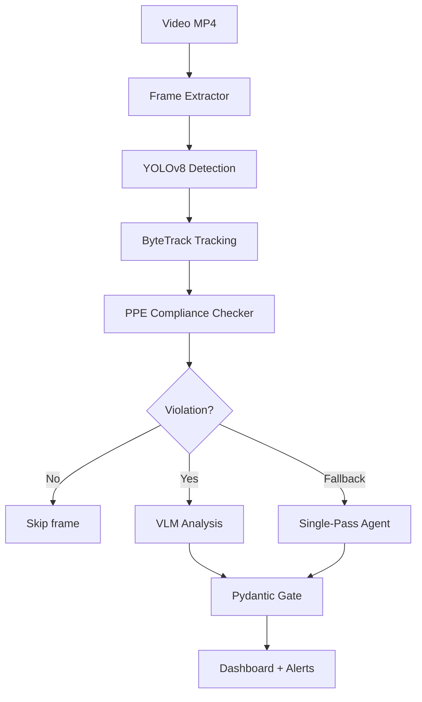

# 🦅 Munin — Industrial Vision Agent

> On-premise PPE detection for mining operations. Powered by AMD MI300X. DS 132 compliant.

[]()
[]()
[]()
[]()
[]()

## Overview

Munin is an industrial vision agent that detects PPE (Personal Protective Equipment) violations in mining operations in real-time. It runs entirely on-premise on AMD MI300X (192GB HBM3) — video never leaves the site.

## Features

- 🏗️ **Two-tier inference** — YOLOv8 fast detection (25 FPS) + VLM contextual analysis on-demand
- 🛡️ **Pydantic Gate** — All VLM output validated against strict schema with retry
- 📋 **DS 132 compliance** — Chilean mining safety regulations built-in
- 🔍 **Multi-agent VLM** — 3 sequential agents (Extractor → Analyzer → Scorer) with Single-Pass fallback
- 🎥 **Video processing** — Stream mode with constant memory footprint
- 🖥️ **Real-time dashboard** — Streamlit UI with annotated video and violation alerts
- 🔐 **100% on-premise** — No cloud dependency, video stays local

## Architecture



## Tech Stack

| Layer | Technology |
|-------|-----------|
| GPU | AMD MI300X (192GB HBM3), ROCm 7.2.4 |
| Detection | YOLOv8n (ultralytics) with ByteTrack tracking |
| VLM | Kimi K2.6 via Fireworks AI (interim) / vLLM ROCm (target) |
| Agent Framework | PydanticAI with FireworksProvider |
| Backend | FastAPI |
| Frontend | Streamlit |
| Validation | Pydantic v2 (structured output) |
| Container | Docker (rocm/vllm-dev) |

## Quickstart

### Docker (AMD GPU)
```bash
cp .env.example .env  # Fill in FIREWORKS_API_KEY
docker build -t munin .
docker run -it --device /dev/kfd --device /dev/dri \
  --group-add video --shm-size 8G \
  -p 8000:8000 -p 8501:8501 munin
```

### Local (CPU fallback)
```bash
pip install -r requirements.txt
cp .env.example .env  # Fill in FIREWORKS_API_KEY
```

## Usage

```bash
# Start API
python main.py  # → http://localhost:8000

# Start dashboard
streamlit run ui/dashboard.py  # → http://localhost:8501

# Run tests
python -m pytest tests/ -v
```

### API Endpoints

| Endpoint | Method | Description |
|----------|--------|-------------|
| `/api/v1/health` | GET | Health check |
| `/api/v1/analyze` | POST | Upload MP4, start analysis |
| `/api/v1/analyze/{job_id}` | GET | Get analysis results |

## Project Structure

```
munin/
├── main.py              # FastAPI entry point
├── config.py            # AppSettings (Pydantic BaseSettings)
├── pipeline/            # Video → YOLO → Track → Compliance
├── agents/              # PydanticAI agents (Extractor, Analyzer, Scorer)
├── vlm/                 # VLM model factory (Fireworks ↔ AMD)
├── gate/                # Pydantic schemas + validation
├── knowledge/           # DS 132 knowledge base + zone config
├── api/                 # FastAPI routes
├── ui/                  # Streamlit dashboard
└── tests/               # Unit + integration tests
```

## Roadmap

> Features marked as **Planned** are designed but not yet implemented.

| Feature | Status | Description |
|---------|--------|-------------|
| ByteTrack tracking | ✅ Implemented | `model.track(persist=True)` replaces manual IoU tracker |
| EPP assignment in checker | ✅ Implemented | Moved from tracker to PPEComplianceChecker (SRP) |
| Dual-class PPE detection | ✅ Implemented | Construction-PPE 11 classes (helmet/no_helmet) |
| Stream mode | ✅ Implemented | `stream=True` for constant memory video processing |
| VLM timeout 300s | ✅ Implemented | Increased from 120s for agentic workloads |
| Prompt caching | ✅ Implemented | `x-session-affinity` header for Fireworks cache hits |
| Frame resize 640×480 | ✅ Implemented | 85% token reduction before VLM encoding |
| Supervision integration | 📋 Planned | `sv.Detections`, `sv.PolygonZone`, annotators for dashboard |
| Fine-tune Construction-PPE | 📋 Planned | Single model replaces dual COCO+PPE pipeline |
| ROCm on-premise VLM | 📋 Planned | vLLM with InternVL2-8B on AMD MI300X |

## DS 132 Compliance

Munin checks PPE compliance against Chilean DS 132 (Decreto Supremo 132):
- **Art. 38:** Mandatory PPE (helmet, vest, boots)
- **Art. 42:** Harness for work at height
- **Art. 45:** Eye protection in processing zones
- **Art. 50:** Maintenance zone requirements

## License

Apache 2.0

## Credits

- **AMD Developer Hackathon Act II** — Pista Unicornio
- **Yechua Silva** — Developer
