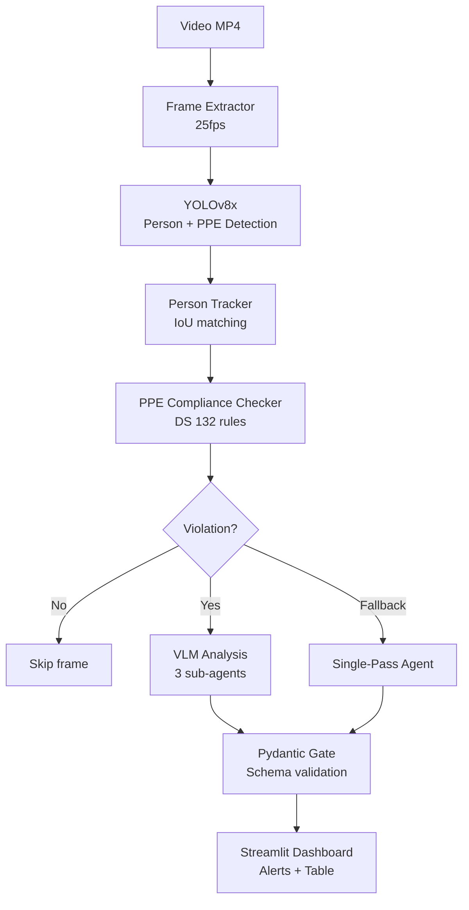

# 🦅 Munin — Industrial Vision Agent

> **AMD Developer Hackathon Act II** | Pista Unicornio | 6-11 Julio 2026
> Detects PPE violations in real-time on AMD MI300X. 100% on-premise. DS 132 compliant.

[]()
[]()
[]()
[]()

## Overview

Munin is an industrial vision agent that detects PPE (Personal Protective Equipment) violations in mining operations. It runs entirely on-premise on AMD MI300X (192GB HBM3) — video never leaves the site.

### Two-tier inference pipeline:
1. **YOLOv8x** (25 FPS, always on) — detects people and PPE
2. **VLM** (on-demand) — contextual analysis when violation detected
3. **Pydantic Gate** — validates all output with strict schema

## Architecture



## Tech Stack

| Layer | Technology |
|-------|-----------|
| GPU | AMD MI300X (192GB HBM3), ROCm 7.2.4 |
| Detection | YOLOv8x/n (ultralytics) |
| VLM (interim) | Qwen3-VL-8B-Instruct via Fireworks AI |
| VLM (target) | InternVL2-8B via vLLM ROCm |
| Agent Framework | PydanticAI with FireworksProvider |
| Backend | FastAPI (Python 3.11+) |
| Frontend | Streamlit |
| Validation | Pydantic v2 (structured output) |
| Container | Docker (rocm/vllm-dev) |

## Requirements

- **Hardware:** AMD MI300X (192GB) or CPU fallback for development
- **Software:** Python 3.11+, ROCm 7.2.4 (for AMD GPU), Docker
- **API Key:** Fireworks AI (for cloud VLM interim)

## Installation

### Docker (recommended for AMD GPU)
```bash
cd munin/
cp .env.example .env  # Fill in FIREWORKS_API_KEY
docker build -t munin .
docker run -it --device /dev/kfd --device /dev/dri -p 8000:8000 -p 8501:8501 munin
```

### Local development (CPU, no GPU required)
```bash
cd munin/
pip install -r requirements.txt
cp .env.example .env  # Fill in FIREWORKS_API_KEY
```

## Usage

### Start the API
```bash
cd munin/
python main.py
# API available at http://localhost:8000
```

### Start the dashboard
```bash
cd munin/
streamlit run ui/dashboard.py
# Dashboard at http://localhost:8501
```

### API Endpoints

| Endpoint | Method | Description |
|----------|--------|-------------|
| `/api/v1/health` | GET | Health check |
| `/api/v1/analyze` | POST | Upload MP4, start analysis |
| `/api/v1/analyze/{job_id}` | GET | Get analysis results |
| `/api/v1/analyze/single-pass/{job_id}` | GET | Single-pass mode results |

### Run tests
```bash
cd munin/
python -m pytest tests/ -v
```

### Generate demo video
```bash
cd munin/
python demo/download_video.py
```

### Smoke test
```bash
cd munin/
python tests/smoke_test.py
```

## Project Structure

```
munin/
├── main.py                 # FastAPI entry point
├── config.py               # AppSettings (Pydantic BaseSettings)
├── exceptions.py           # Custom exception hierarchy
├── pipeline/               # Video → YOLO → Track → Compliance
├── agents/                 # PydanticAI agents (Extractor, Analyzer, Scorer)
├── vlm/                    # VLM model factory (Fireworks ↔ AMD)
├── gate/                   # Pydantic schemas + validation gate
├── knowledge/              # DS 132 knowledge base + zone config
├── api/                    # FastAPI routes
├── ui/                     # Streamlit dashboard
├── tests/                  # Unit + integration tests
└── demo/                   # Demo video generator
```

## DS 132 Compliance

Munin checks PPE compliance against Chilean DS 132 (Decreto Supremo 132):
- **Art. 38:** Mandatory PPE (helmet, vest, boots)
- **Art. 42:** Harness for work at height
- **Art. 45:** Eye protection in processing zones
- **Art. 50:** Maintenance zone requirements

## License

Apache 2.0

## Credits

- **AMD Developer Hackathon Act II** — Pista Unicornio
- **Yechua Silva** — Developer
- **ZyroCLI + PydanticAI + Fireworks AI** — Tools & infrastructure
